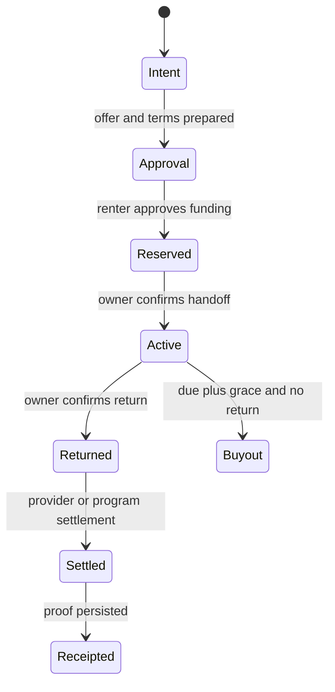

# Agent flow and approval boundaries

## Control model

The LLM may parse, rank, explain, and summarize. Deterministic code owns
availability, prices, deposits, transaction construction, state transitions,
payment verification, settlement math, and metric emission.

## Inspectable timeline

The full timeline is available only in the explicit seeded-demo profile. Normal
wallet history returns aggregate funnel evidence without exposing internal tool
details until an authenticated operator/user projection is implemented.

Each provider-funded intent can expose:

1. intent received;
2. inventory checked;
3. offer selected;
4. deterministic terms drafted;
5. renter approval requested;
6. funding confirmed;
7. owner handoff confirmed;
8. owner return confirmed;
9. settlement completed;
10. receipt issued.

Every event includes timestamp, actor, tool, secret-safe summary, approval
requirement, status, environment, activity type, payment mode, and optional
public record reference. Deterministic event IDs make repeated provider events
idempotent.

## Required human approvals

- Renter: card authorization or wallet transaction.
- Owner/operator: listing publication, handoff, return condition.
- Operator: dispute outcome or payout destination changes.
- User or operator: any mainnet or real-value action.

## Recovery behavior

- Telemetry failure does not retry or duplicate a payment transition; APIs
  return the commercial result with `executionTraceStatus`.
- Provider webhook duplicates resolve to the same deterministic event ID.
- A failed funding attempt remains separate from funded state.
- Receipt absence means the flow is not represented as fully complete.
- Provider, database, and chain reconciliation remains a pre-pilot production
  gap and requires an operator runbook.
