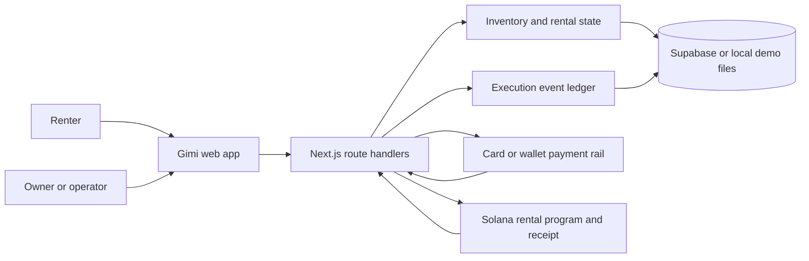

# Gimi architecture

## Product boundary

Gimi coordinates one bounded community rental from request through custody,
settlement, and receipt. Humans continue to approve money movement, listing
publication, physical handoff, return condition, and disputes.

## Components

| Component | Responsibility | Current boundary |
|---|---|---|
| `public/gimi.html` | Agent-first renter UI and operator profile | Static shell controlled by same-origin Next parent |
| `GimiAppShell.tsx` | Privy session, wallet signing, Stripe card-link controller | Browser-held user approval; no server Solana key |
| Rental APIs | Quote, intent, handoff, return, settlement, history | Handoff and provider-return actions require action-specific owner wallet signatures; other operator routes still need a complete auth review |
| Execution event ledger | Timestamped actor/tool/approval/status/provenance timeline | Append-only IDs; Supabase migration 010 or local demo file; detailed timeline is disclosed only in explicit seeded-demo mode |
| Supabase repositories | Durable listings, sessions, intents, receipts, notifications, events | Service-role server access; migrations must be applied |
| Anchor program | USDC escrow, rental session, return request, settlement, rental token | Deployed/tested on Solana devnet, not represented as mainnet production |
| Stripe Redbox | TEST-only refundable authorization and post-return partial capture | Live Stripe keys are rejected |
| MoonPay adapter | Hosted/API checkout plus signed webhook mapping | Production depends on partner credentials and verified provider behavior |
| Base MCP | Inventory, quote, deposit-call preparation, confirmation record | Agent/tool surface; not a replacement for production escrow verification |
| ElevenLabs / LI.FI | Voice token/tools and cross-chain quote preparation | Optional, outside the first pilot critical path |

## State ownership

- Rental intent is the provider-neutral commercial record.
- Rental session is physical custody and on-chain escrow state.
- Receipt is the final settlement proof.
- Execution events explain what happened; they never authorize or replace a
  rental state transition.
- Environment and activity labels prevent demo/devnet activity from entering
  commercial metrics silently.

## Primary pilot path

The initial partner demo uses one low-risk power item and one card/test flow.
Solana remains the receipt/proof rail. Other integrations remain visible in
diligence but are not equal primary paths.
